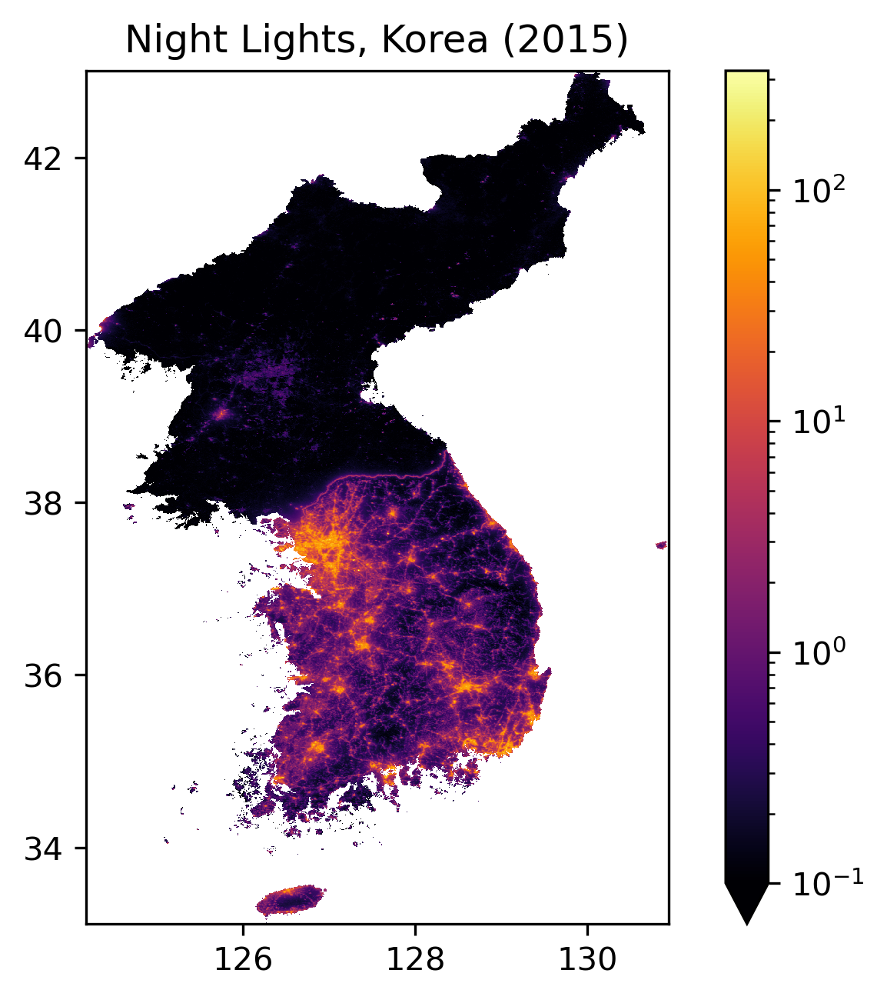
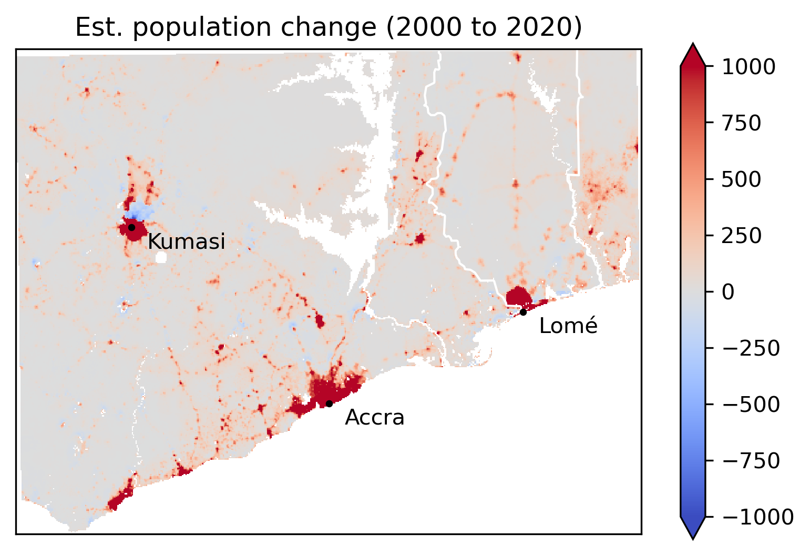

# WorldPopPy

[](https://pypi.org/project/WorldPopPy/)
[](https://github.com/lungoruscello/WorldPopPy/blob/master/LICENSE.txt)

**WorldPopPy** is a Python package that helps you work with data from the [WorldPop project](https://www.worldpop.org/).
WorldPop offers [global, gridded geo-datasets](https://www.worldpop.org/datacatalog/) on population dynamics, land-cover
features,
night-light emissions, and several other attributes of human and natural geography.
This package streamlines the process of downloading, combining, and cleaning WorldPop data for
different geographic regions and years.

## Key Features

* Fetch data for any part of the world by passing GeoDataFrames, country codes, or bounding boxes.
* Easy handling of annual time-series through integration with [`xarray`](https://docs.xarray.dev/en/stable/).
* Parallel data downloads with retry mechanism and ability to preview estimated download sizes (dry run).
* Auto-updating manifest so you stay up-to-date with WorldPop’s latest available datasets.

## Installation

**WorldPopPy** is available on [PyPI](https://pypi.org/project/WorldPopPy/) and can be
installed using `pip`:

`pip install worldpoppy`

## Quickstart

```python
import matplotlib.pyplot as plt
from matplotlib.colors import LogNorm

from worldpoppy import wp_raster, clean_axis

# Fetch night-light data for the Korean Peninsula. Note: Calling 
# `wp-raster()` returns an `xarray.DataArray` ready for analysis and plotting
viirs_data = wp_raster(
    product_name='viirs_100m',  # name of WorldPop's night-light product
    aoi=['PRK', 'KOR'],  # three-letter country codes for North and South Korea  
    years=2015,
    masked=True,  # mask missing values with NaN (instead of WorldPop's default fill value),
)

# Downsample the data to speed-up plotting
lowres = viirs_data.coarsen(x=5, y=5, boundary='trim').mean()

# Plot
lowres.plot(vmin=0.1, cmap='inferno', norm=LogNorm())
clean_axis(title='Night Lights (2015)\nKorean Peninsula')

plt.show()
```

 

## More detailed example

Below, we visualise **population growth** in a patch of West Africa from 2000 to 2020. To select the geographic area 
of interest, we use a helper function that converts a location name into a bounding box. The example below also shows 
you how to re-project WorldPop data into a different Coordinate Reference System (CRS).

```python
import matplotlib.pyplot as plt
import numpy as np

from worldpoppy import *

# Define the area of interest 
# Note: `bbox_from_location` runs a `Nomatim` query under the hood 
aoi_box = bbox_from_location('Accra', width_km=500)  # returns (min_lon, min_lat, max_lon, max_lat)

# Define the target CRS (optional)
aeqa_africa = "ESRI:102022"  # an Albers Equal Area projection optimised for Africa

# Fetch the population data
pop_data = wp_raster(
    product_name='ppp',  # name of the WorldPop product (here: est. no. of people per raster cell)
    aoi=aoi_box,  # you could also pass a GeoDataFrame or official country codes
    years=[2000, 2020],  # the years of interest (for annual WorldPop products only)
    masked=True,  # mask missing values with NaN (instead of WorldPop's default fill value),
    to_crs=aeqa_africa  # if None is provided, the CRS of the source data will be kept (EPSG:4326)
)

# Compute population changes on downsampled data
lowres = pop_data.coarsen(x=10, y=10, year=1, boundary='trim').reduce(np.sum)  # will propagate NaNs
pop_change = lowres.sel(year=2020) - lowres.sel(year=2000)

# Plot
pop_change.plot(cmap='coolwarm', vmax=1_000, cbar_kwargs=dict(shrink=0.85))
clean_axis(title='Estimated population change (2000 to 2020)')

# Add visual references
plot_country_borders(['GHA', 'TOG', 'BEN'], edgecolor='white', to_crs=aeqa_africa)
plot_location_markers(['Accra', 'Kumasi', 'Lomé'], to_crs=aeqa_africa)

plt.show()
```

 

## Further information

### Data dimensions

Calling [`wp_raster()`](https://github.com/lungoruscello/WorldPopPy/blob/master/worldpoppy/raster.py#L72) will always 
return an **`xarray.DataArray`**. The array dimensions, however, depend on the user query. If you request data for more 
than one year, the returned array will include a *year* dimension in addition to the raster data's two spatial dimensions 
(*x* and *y*). By contrast, the *year* dimension will be omitted if you request data for a single year only, or if the 
WorldPop product in question is static anyway (e.g., when requesting [elevation data](https://github.com/lungoruscello/WorldPopPy/blob/master/worldpoppy/examples/example5.py)). 

### Managing the local cache

By default, downloaded source data from WorldPop will be cached on disk. When calling `wp_raster()`, wou can disable 
caching by setting `cache_downloads=False`. 

The default cache directory is `~/.cache/worldpoppy`, and can be changed by setting an environment variable, as
shown [here](https://github.com/lungoruscello/WorldPopPy/blob/master/worldpoppy/examples/example4.py).

Use the following function to check the local cache size and purge cached data to restore disk space:

```python
from worldpoppy import purge_cache

purge_cache(dry_run=True)
# the dry run will not actually delete anything and merely print a cache summary
```

### Download dry runs

Before you request data for large geographic areas and/or many years, you may want to check download requirements first. 
To do so, simply set `download_dry_run=True`:  

```python
from worldpoppy import wp_raster

_ = wp_raster(
    product_name='ppp',
    aoi='CAN USA MEX'.split(),
    years='all',  # get all available years for the requested product 
    download_dry_run=True
)
```
When you request a dry run, no actual WorldPop data will be downloaded or processed and `wp_raster` will return `None`.


### Selecting data with a GeoDataFrame

... is straightforward, as shown in [this example](https://github.com/lungoruscello/WorldPopPy/blob/master/worldpoppy/examples/example3.py). 

### The WorldPop data manifest

Use the `wp_manifest` function to load (and optionally filter) the manifest file listing all currently available WorldPop 
datasets:

```python
from worldpoppy import wp_manifest

full_manifest = wp_manifest()  # returns a `pandas.DataFrame`
full_manifest.head(2)
```

The local manifest is auto-updated by [comparing it against](https://github.com/lungoruscello/WorldPopPy/blob/master/worldpoppy/manifest.py#L250) 
a remote version that is hosted on WorldPop servers. If needed, the remote manifest is downloaded and cleaned 
for local use. Note that the remote WorldPop manifest sometimes lists datasets that are not actually available for 
download. Requesting such datasets will trigger a [`DownloadError`](https://github.com/lungoruscello/WorldPopPy/blob/master/worldpoppy/download.py#L206). 


### Downloads only? 

If you are only interested in asynchronous country-data downloads, without any further functionality, use the `WorldPopDownloader` class:

```python
from worldpoppy import WorldPopDownloader

raster_fpaths = WorldPopDownloader().download(
    product_name='srtm_slope_100m',  # topographic slope
    iso3_codes=['LIE'],  # Liechtenstein
)
```


## Dependencies

## Acknowledgements

**WorldPopPy** is inspired by the [BlackMarblePy](https://github.com/worldbank/blackmarblepy/tree/main) 
package, which simplifies working with daily, monthly, and yearly night-light data from NASA's Black Marble project.

## Feedback

If you encounter issues, or want to suggest improvements, please [open an issue](https://github.com/lungoruscello/WorldPopPy/issues).
Note that WorldPopPy is being developed and tested on Linux. Issues encountered on other platforms may take longer to address.


## License

This projects is licensed under the [Mozilla Public License](https://www.mozilla.org/en-US/MPL/2.0/).
See [LICENSE.txt](LICENSE.txt)  for details.
