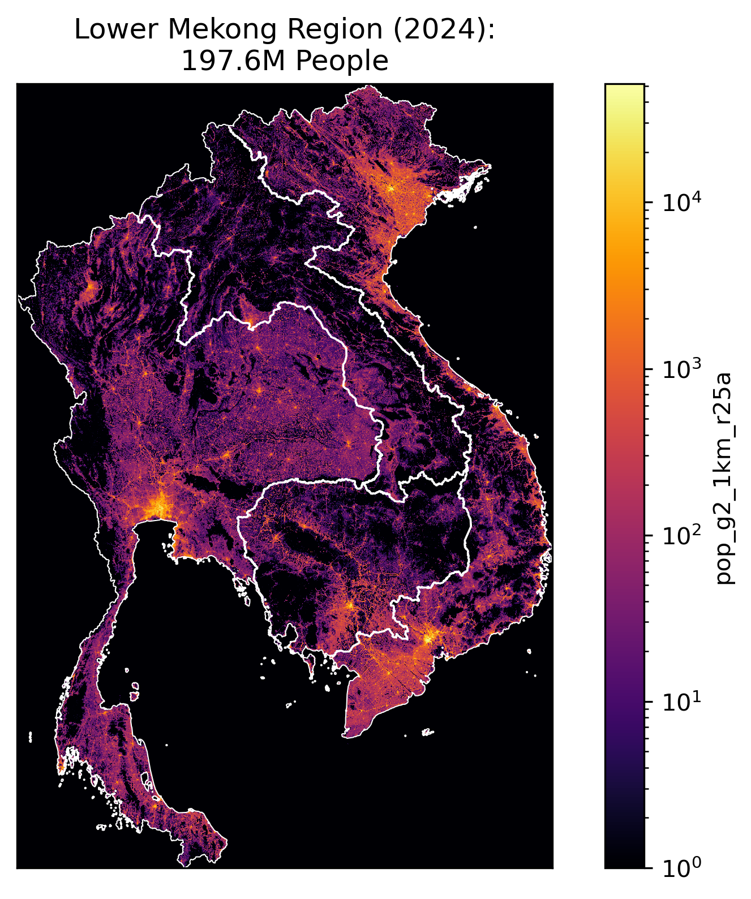
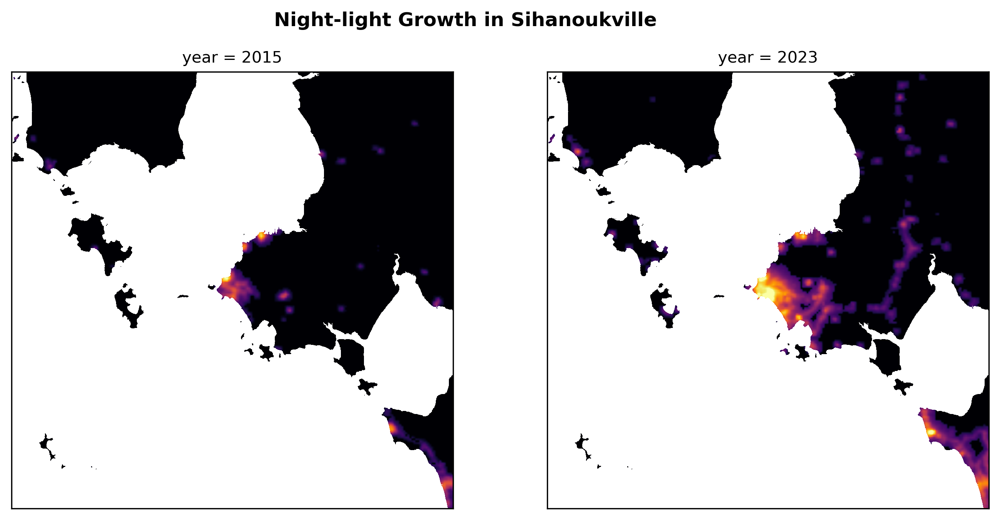
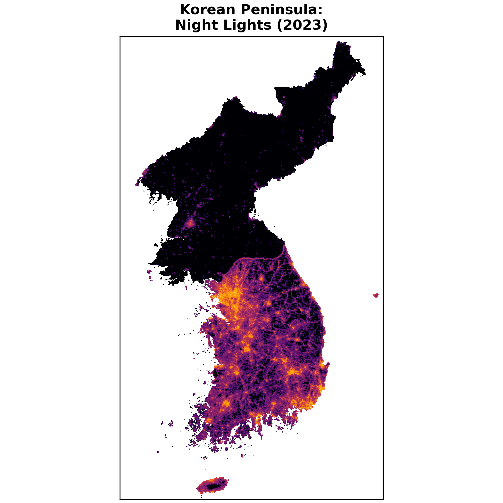
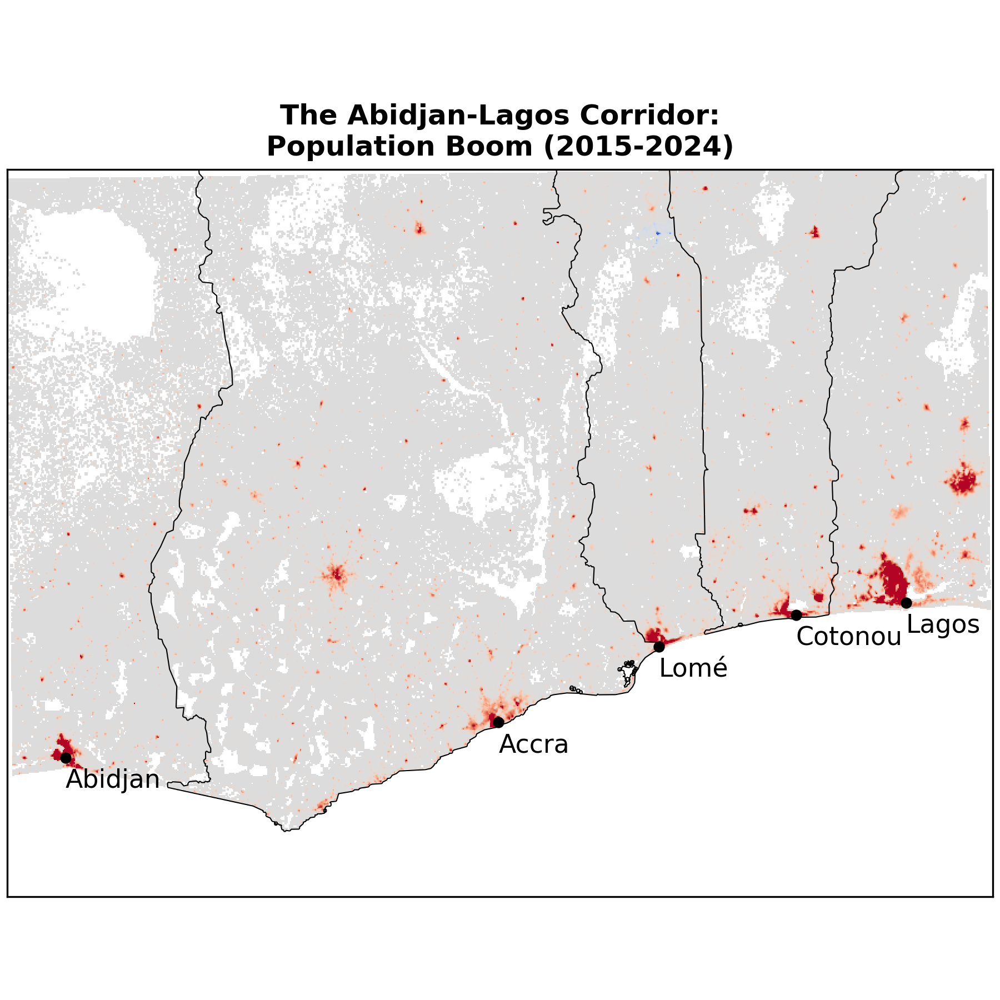
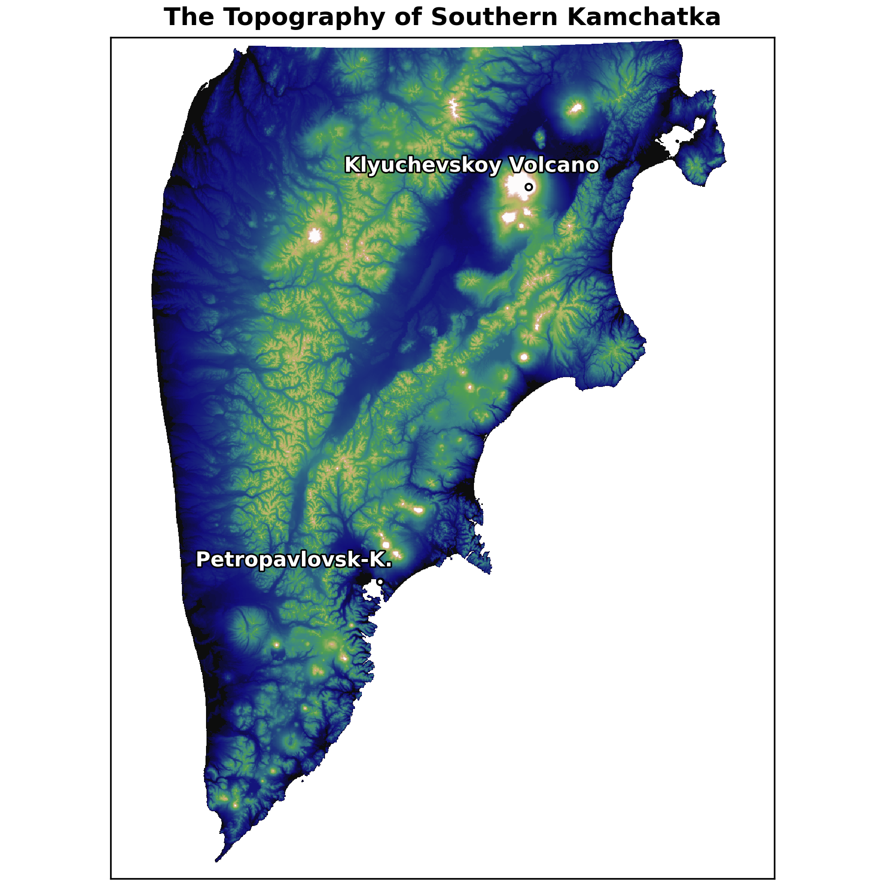
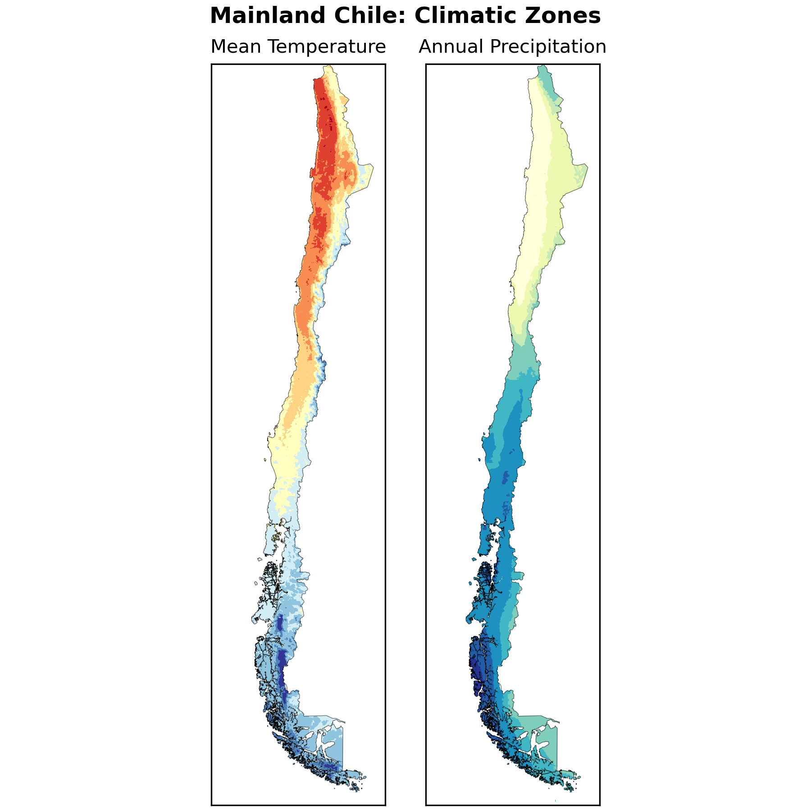

# WorldPopPy 

*A Python client for downloading, merging, and processing WorldPop raster data.*

<!-- 
Keywords: WorldPop Python package, download and combine WorldPop datasets, global raster data, population rasters, land cover rasters, night lights imagery, Python GIS toolkit
-->

[](https://pypi.org/project/WorldPopPy/)
[](https://github.com/lungoruscello/WorldPopPy/blob/master/LICENSE.txt)

**WorldPopPy** provides a programmatic interface to the [WorldPop](https://www.worldpop.org/) open data archive.

WorldPop provides global, gridded datasets on population dynamics, night-light emissions, land cover, and much more. 
These datasets are typically distributed as individual files per country. **WorldPopPy** abstracts the process of
data discovery, retrieval, and preprocessing. Users query data by Area of Interest (AOI). The library automatically 
identifies the necessary country rasters, downloads them, and merges them into a unified dataset.

(See the [Example Gallery](#example-gallery) below for a visual overview of the library's capabilities).

## Key Features

* Fetch data for any region by passing GeoDataFrames, country codes, or geographic bounding boxes.
* Easy handling of raster time-series through integration with [`xarray`](https://docs.xarray.dev/en/stable/).
* Parallel data downloads with automatic retry logic, local caching, and dry-run support.
* Searchable data manifest, allowing you to quickly find WorldPop products of interest.
* Optimisations to handle large country rasters, including automatic spatial subsetting and optional lazy loading with Dask.

## Installation

```bash
pip install worldpoppy
```

## Quickstart
### Example 1: Merging Raster Data for Several Countries 

```python
import matplotlib.pyplot as plt
from matplotlib.colors import LogNorm

from worldpoppy import wp_raster, clean_axes, plot_country_borders

# Fetch & Merge Population Rasters
# Data is returned as xarray.DataArray ready for analysis and plotting.
countries = ['THA', 'KHM', 'LAO', 'VNM']
pop_data = wp_raster(
    product_name='pop_g2_1km_r25a',  # Low-res. pop. estimates (Global 2 series)
    aoi=countries, years=2024
)

# Plot (Log-scale) 
# We use fillna(0) to represent areas without population and +1 to avoid log(0).
(pop_data.fillna(0) + 1).plot(norm=LogNorm(), cmap='inferno', size=6)

plot_country_borders(countries, edgecolor='white', linewidth=0.5)
clean_axes(title=f"Lower Mekong Region (2024):\n{pop_data.sum() / 1e6:.1f}M People")
plt.show()
```
 

### Example 2: Built-in Support for Time-series

```python
import matplotlib.pyplot as plt
from matplotlib.colors import LogNorm

from worldpoppy import wp_raster, bbox_from_location, clean_axes

# Fetch Two Years of Night-light Data for Sihanoukville
ntl_data = wp_raster(
    product_name="ntl_viirs_g2",
    aoi=bbox_from_location("Preah Sihanouk", width_km=100),
    years=[2015, 2023],  # Stacked along "year" dimension of DataArray 
)

# Plot: Xarray can create a facet grid by year
p = (ntl_data + 1).plot(
    col="year", figsize=(10, 5),
    cmap="inferno", vmax=50, norm=LogNorm(),
    add_colorbar=False  # Remove since radiance units are not intuitive
)

p.fig.suptitle('Night-light Growth in Sihanoukville', fontsize=12, fontweight='bold')
p.fig.subplots_adjust(top=0.875)
clean_axes(p)
```


## Finding Data

Use `show_supported_data_products` to get a quick overview of what is supported by **WorldPopPy**:

```python
from worldpoppy import show_supported_data_products

# Print data products related to "population" from the Global 2 series 
show_supported_data_products(keywords=["population", "global2"])

# Print static (single-year) data products available for Brazil
show_supported_data_products(static_only=True, iso3_codes="BRA")
``` 

Alternatively, you can also get the library's full data manifest as a pandas DataFrame:

```python
from worldpoppy import wp_manifest

mdf = wp_manifest()
mdf.head()
```
## Documentation

* **API Reference:** https://worldpoppy.readthedocs.io/

* **Examples:** See the [`examples/`](./examples/) folder in this repository.

## Example Gallery

<table>
  <tr>
    <td width="50%" valign="top">
      <h3 align="center">1. Visualising Night Lights</h3>
      <div align="center">
        <a href="./examples/quickstart/03_korea_lights.py">
          
        </a>
      </div>
      <p align="center">
        <b>The Korean Peninsula.</b><br>
        Fetch, merge, and reproject night-light data for the two Koreas.
        <br/>
        <a href="./examples/quickstart/03_korea_lights.py">View Script &rarr;</a>
      </p>
    </td>
    <td width="50%" valign="top">
      <h3 align="center">2. Analysing Population Growth</h3>
      <div align="center">
        <a href="./examples/quickstart/04_west_africa_growth.py">
          
        </a>
      </div>
      <p align="center">
        <b>The Abidjan-Lagos Corridor.</b><br>
        Calculate 10-year population change along the West African coast.
        <br/>
        <a href="./examples/quickstart/04_west_africa_growth.py">View Script &rarr;</a>
      </p>
    </td>
  </tr>
</table>

<table>
  <tr>
    <td width="50%" valign="top">
      <h3 align="center">3. Automatic Memory Optimisation</h3>
      <div align="center">
        <a href="./examples/large_rasters/01_kamchatka_topo_eager.py">
          
        </a>
      </div>
      <p align="center">
        <b>Southern Kamchatka.</b><br>
        Handle massive source rasters (2GB+) efficiently via automatic spatial subsetting.
        <br/>
        <a href="./examples/large_rasters/01_kamchatka_topo_eager.py">View Script &rarr;</a>
      </p>
    </td>
    <td width="50%" valign="top">
      <h3 align="center">4. Manual Memory Optimisation</h3>
      <div align="center">
        <a href="./examples/large_rasters/02-chile_weather_dask.py">
          
        </a>
      </div>
      <p align="center">
        <b>Climatic Zones of Chile.</b><br>
        Clip irregular country geometries and lazy-load data with Dask.
        <br/>
        <a href="./examples/large_rasters/02-chile_weather_dask.py">View Script &rarr;</a>
      </p>
    </td>
  </tr>
</table>

## Acknowledgements

**WorldPopPy** is inspired by the World Bank's [BlackMarblePy](https://github.com/worldbank/blackmarblepy/tree/main) package, which provided the blueprint for the  
download module used in this library and informed the API design.

## Licence

This project is licensed under the [Mozilla Public License](https://www.mozilla.org/en-US/MPL/2.0/).
See [LICENSE.txt](./LICENSE.txt) for details.
